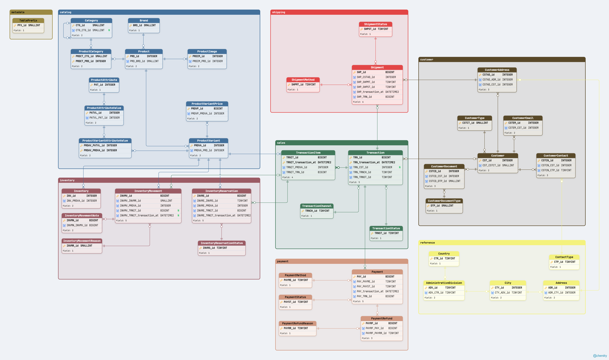

# AtlasCommerce Architecture

## 1. Purpose

This document defines the architecture of AtlasCommerce as the transactional source system within the Atlas Engineering data platform.

Its purpose is to describe the major architectural components, responsibilities, boundaries, and design decisions that determine how AtlasCommerce stores operational data and participates in the broader data platform.

AtlasCommerce is designed primarily to support transactional retail operations.

Analytical workloads, reporting, data transformation, and business intelligence are separate architectural responsibilities and must not compromise the reliability or performance of the transactional workload.

This document describes:

- The architectural role of AtlasCommerce within Atlas Engineering.
- The boundaries between transactional and analytical responsibilities.
- The logical organization of the AtlasCommerce database.
- The responsibilities represented by its database domains.
- The physical database architecture where it affects system design.
- The principles governing data extraction from the transactional source.
- The relationship between AtlasCommerce and downstream ingestion, staging, analytical, and consumption layers.
- The architectural decisions that support reliability, maintainability, scalability, traceability, and future evolution.

This document does not define detailed business rules, database object naming conventions, individual table definitions, or deployment implementation rules.

Those responsibilities are documented separately in the applicable AtlasCommerce business, database standards, domain-model, and technical deployment documentation.

The architecture described here represents the current validated architecture of AtlasCommerce together with the explicitly identified architectural direction of Atlas Engineering.

When the architecture changes, this document must be updated so that implemented capabilities continue to reflect the system that AtlasCommerce actually builds and validates, while future architectural directions remain explicitly identified as such.

---

## 2. Architecture Context

AtlasCommerce is the transactional source system used by Atlas Engineering to represent the operational retail domain.

Its primary responsibility is to persist and protect the operational state required by retail processes such as product management, customer management, inventory control, sales, payments, and fulfillment.

AtlasCommerce is not the analytical platform itself.

Within the broader Atlas Engineering architecture, AtlasCommerce occupies the source-system layer and provides operational data that may be consumed by downstream data-engineering processes.

The architectural context is:

```text
Atlas Engineering
│
├── Source Systems
│   │
│   └── AtlasCommerce
│       └── SQL Server transactional database
│
├── Data Ingestion
│
├── Staging and Data Processing
│
├── Analytical Data Platform
│
└── Data Consumption
    └── Business Intelligence and analytical workloads
```

At the current stage of the project, AtlasCommerce is the implemented transactional source system.

The downstream layers represent the architectural direction of Atlas Engineering and will be designed and implemented during the corresponding data-engineering phases.

Their representation in this document establishes architectural boundaries and responsibilities; it does not imply that their final technologies, structures, or implementation strategies have already been defined.

---

### 2.1 Transactional Responsibility

AtlasCommerce is responsible for operational persistence and transactional data integrity.

Its database design must prioritize:

- Correctness of persisted operational state.
- Transactional consistency.
- Referential integrity.
- Predictable operational behavior.
- Protection of business-critical data.
- Maintainability and controlled evolution.
- Reliable availability of source data for downstream consumption.

The transactional database must not be redesigned primarily to satisfy analytical access patterns.

Analytical requirements may influence how data is extracted or interpreted downstream, but they must not compromise the integrity or primary operational responsibility of AtlasCommerce.

---

### 2.2 Analytical Responsibility

Analytical processing is a separate architectural responsibility.

Reporting, historical analysis, analytical transformations, aggregations, dimensional modeling, and business-intelligence workloads must be performed outside the primary AtlasCommerce transactional workload whenever practical.

This separation allows the analytical platform to evolve according to analytical requirements without forcing the transactional model to assume responsibilities for which it was not designed.

Likewise, AtlasCommerce can evolve according to operational requirements without requiring its internal transactional structure to become the presentation model for analytical consumers.

---

### 2.3 Architectural Boundary

The principal architectural boundary is therefore:

```text
Operational Responsibility              Analytical Responsibility

AtlasCommerce
Transactional Database
        │
        │  controlled data extraction
        ▼
Data Engineering
        │
        ▼
Analytical Platform
        │
        ▼
Analytical Consumers
```

Crossing this boundary requires an explicit data-extraction or ingestion process.

Analytical consumers must not depend on unrestricted direct access to the primary transactional database as their normal data-access strategy.

The mechanism used to cross this boundary will be selected according to source-system characteristics, operational impact, data-latency requirements, recoverability, and the architecture defined during the data-engineering phase.

---

### 2.4 Architectural Independence

The transactional and analytical architectures are related but independently designed.

AtlasCommerce defines the operational truth of the retail system.

Downstream analytical structures may reorganize, transform, enrich, aggregate, or historize that data according to analytical requirements without changing the meaning of the source data.

This separation allows Atlas Engineering to introduce future ingestion technologies, staging strategies, analytical storage models, orchestration mechanisms, or consumption tools without requiring unnecessary redesign of the AtlasCommerce transactional model.

The architectural contract between the two sides is therefore based on controlled consumption of operational data rather than shared physical design.

---

## 3. AtlasCommerce Database Architecture

AtlasCommerce is implemented as a SQL Server transactional database organized around explicit business and technical domains.

The database is designed as a single transactional boundary whose internal responsibilities are separated through database schemas.

This organization allows related objects to remain logically grouped while preserving referential integrity and transactional consistency across domains.

The high-level database architecture is:

```text
AtlasCommerce
│
├── metadata
│   └── Technical metadata and database governance
│
├── catalog
│   └── Product catalog, classification, variants, attributes, media, and pricing
│
├── customer
│   └── Customer identity, documents, contacts, addresses, and related master data
│
├── inventory
│   └── Inventory position, movements, movement context, and stock reservations
│
├── payment
│   └── Payments, payment methods, payment status, refunds, and refund reasons
│
├── reference
│   └── Shared reference data used across business domains
│
├── sales
│   └── Sales transactions, transaction items, channels, and transaction status
│
└── shipping
    └── Shipment, delivery method, delivery status, tracking, and freight information
```

Schemas represent logical responsibility boundaries within the database.

They do not represent independent databases, isolated transactional systems, or separate deployment units.

Relationships may cross schema boundaries when required by the persistent data model.

---

### 3.1 Data Model Overview

The following diagram provides a high-level representation of the
AtlasCommerce relational data model.

It shows the database schemas, the entities assigned to each domain,
their primary and foreign key structures, and the relationships that
cross domain boundaries.



The diagram intentionally focuses on structural relationships and key
columns rather than reproducing the complete column definition of each
entity.

The diagram was created using Schemity Lite from the validated
AtlasCommerce database model.

---

### 3.2 Single Transactional Database

AtlasCommerce currently uses a single transactional database for the implemented retail model.

This architecture allows business operations that span multiple domains to participate in a consistent relational model.

For example, a sales transaction may depend on information maintained by customer, catalog, inventory, payment, or shipping domains without requiring those responsibilities to be physically separated into independent databases.

The use of a single database does not imply that all objects belong to the same logical responsibility.

Domain boundaries remain explicit through schemas, object ownership, relationships, documentation, and deployment organization.

This approach favors relational integrity and transactional consistency while avoiding premature physical distribution of tightly related operational data.

Future architectural requirements may justify additional databases or other architectural components, but such separation must be based on explicit operational, scalability, security, ownership, or lifecycle requirements rather than on domain boundaries alone.

---

### 3.3 Domain-Oriented Schema Organization

Each AtlasCommerce schema represents a primary business domain or technical responsibility.

The current schema responsibilities are:

| Schema | Architectural Responsibility |
|---|---|
| `metadata` | Database governance and technical metadata |
| `catalog` | Product catalog and commercial product definition |
| `customer` | Customer identity and customer-related master data |
| `inventory` | Stock state, movement history, and reservation responsibility |
| `payment` | Payment lifecycle and refund responsibility |
| `reference` | Shared reference information used by multiple domains |
| `sales` | Commercial transaction and transaction-item responsibility |
| `shipping` | Fulfillment and shipment responsibility |

The schema boundary communicates ownership and organization.

It must not be interpreted as a prohibition against relationships between domains.

Cross-domain relationships are expected when they represent legitimate persistent business relationships.

---

### 3.4 Technical Governance Domain

The `metadata` schema has a different architectural responsibility from the business-domain schemas.

It exists to support technical governance of the database rather than represent a retail business process.

Objects in `metadata` may support naming governance, deployment behavior, validation, traceability, or other database-level technical responsibilities.

Because of this role, `metadata` receives intentional precedence in logical database ordering.

This precedence is technical and must not be interpreted as a business-domain hierarchy.

---

### 3.5 Shared Reference Domain

The `reference` schema contains reference information whose responsibility is not owned exclusively by a single business domain.

Reference data may be consumed by objects from multiple schemas while retaining a single authoritative representation within AtlasCommerce.

The existence of the `reference` schema does not mean that all lookup or controlled data belongs there.

A controlled value whose lifecycle and meaning are owned by a specific business domain should remain within that domain.

The `reference` schema is reserved for information that is genuinely shared across domain boundaries.

---

### 3.6 Cross-Domain Relationships

AtlasCommerce permits referential relationships across schemas when those relationships represent the persistent operational model.

A schema boundary must not result in duplication of authoritative data solely to avoid a cross-domain foreign key.

For example, a domain may reference an entity owned by another domain rather than maintain an independent copy of the same operational identity.

Cross-domain relationships must preserve clear ownership:

- The owning domain remains responsible for the entity it persists.
- Referencing domains consume that identity through explicit relationships.
- Referential integrity protects relationships where the database model requires them.
- A relationship does not transfer ownership of the referenced entity to the consuming domain.

This allows AtlasCommerce to maintain domain organization without sacrificing relational consistency.

---

### 3.7 Domain Boundaries and Business Processes

Business processes may span multiple database domains.

The schema containing an object identifies the primary responsibility for that persisted state; it does not imply that the complete business process occurs within that schema.

A retail transaction, for example, may involve:

```text
                 customer
                     │
                     ▼
catalog ─────────► sales
                 /   |   \
                ▼    ▼    ▼
          inventory payment shipping
```

This diagram represents domain interaction rather than a mandatory execution sequence.

Not every transaction requires every domain to participate.

For example, fulfillment requirements depend on the sales scenario, and a transaction completed directly at a physical store does not require a shipment solely because the `shipping` domain exists.

The detailed business conditions governing these interactions are defined by the AtlasCommerce business documentation.

The detailed entity relationships are defined by the AtlasCommerce domain model.

---

### 3.8 Architectural Separation from Object Standards

The database architecture defines where responsibilities belong and how the major domains relate.

It does not redefine the implementation conventions used by individual database objects.

Naming, prefixes, keys, constraints, indexes, object documentation, deployment behavior, validation, and object ordering are governed by the AtlasCommerce Database Standards.

This separation allows architectural decisions and implementation standards to evolve in a controlled manner without duplicating their definitions across documents.

---

## 4. Physical Database Architecture

The physical architecture of AtlasCommerce supports the operational requirements of the transactional model while providing explicit structures for storage organization, partitioning, and controlled growth.

Physical design is treated separately from logical domain organization.

Schemas define logical responsibility.

Filegroups, partition functions, partition schemes, clustered structures, and indexes define how database objects are physically organized when the implementation requires an explicit physical design.

A logical relationship between objects does not require them to share the same physical storage strategy.

Likewise, physical placement must not redefine business or domain ownership.

---

### 4.1 Structural Storage

AtlasCommerce uses `FG_CORE` as the standard structural filegroup for database objects whose implemented physical definition explicitly assigns them to the common non-partitioned storage structure.

Objects placed on `FG_CORE` may include tables, constraints, or indexes according to their implemented physical definitions.

`FG_CORE` represents a physical storage responsibility.

It is not a business domain and must not be interpreted as an alternative to schema organization.

The logical and physical perspectives therefore remain separate:

```text
Logical Organization
│
├── metadata
├── catalog
├── customer
├── inventory
├── payment
├── reference
├── sales
└── shipping

Physical Organization
│
├── FG_CORE
│   └── Standard structural storage
│
└── Partitioned storage
    └── Partition-scheme-managed placement
```

The exact physical placement of an object is defined by the implemented database deployment.

An object must not be moved between physical storage structures solely for visual consistency or because another object in the same schema uses a different placement strategy.

---

### 4.2 Partitioning Architecture

AtlasCommerce uses table partitioning where data characteristics, temporal access patterns, lifecycle considerations, and operational requirements justify a partition-aware physical design.

Partitioning is therefore selective rather than a universal characteristic of transactional tables.

A table must not be partitioned merely because it is expected to grow.

The decision must consider the characteristics of the data and the operations that will be performed against it.

The partitioning architecture separates:

- The logical table definition.
- The partitioning key.
- The partition function.
- The partition scheme.
- The physical placement managed through that scheme.
- The alignment requirements of indexes associated with the partitioned object.

These elements form a coordinated physical design.

A partitioned table must not be evaluated only by its logical columns and constraints when partitioning characteristics form part of its expected implementation.

---

### 4.3 Time-Based Partitioning

Transactional data whose lifecycle is naturally associated with time may use a time-based column as part of the partitioning architecture.

When the partitioning column also participates in keys or relationships, its presence is not an accidental duplication of temporal information.

It forms part of the physical and relational design required to preserve compatibility with the partitioned structure.

This can result in definitions in which a transactional identifier is accompanied by a time-based component in:

- Primary keys.
- Candidate keys.
- Foreign keys.
- Supporting indexes.
- Partition-aligned indexes.

For example, relationships involving partitioned transactional entities may require both an identifier and the corresponding transaction timestamp.

The additional time-based component must therefore be interpreted in the context of the partitioning architecture rather than as an independent business identifier.

---

### 4.4 Partition Alignment

Indexes associated with partitioned tables may be required to remain aligned with the owning table.

When alignment is part of the implemented physical definition, the index must use the expected partitioning infrastructure and partitioning column.

Logical equivalence alone is not sufficient.

An index with the expected key columns but an incompatible partition scheme or partitioning definition represents a physically different architecture.

Partition alignment supports predictable management of partitioned data and preserves consistency between the table and the physical access structures designed around it.

The expected alignment of each applicable index is defined and validated by the database deployment.

---

### 4.5 Physical Design and Relational Integrity

Physical architecture and relational integrity must be designed together when one affects the other.

Partitioning may influence:

- Primary key composition.
- Candidate key composition.
- Foreign key composition.
- Index design.
- Physical placement.
- Validation requirements.

These effects do not change the semantic ownership of the underlying data.

For example, adding a time-based component to a key to support a partition-aware design does not make that value the primary business identity of the entity.

The logical meaning of the relationship remains defined by the data model, while the complete implemented key preserves the requirements of the physical architecture.

---

### 4.6 Physical Architecture Validation

Physical architecture is part of the expected AtlasCommerce database state.

Where applicable, deployment and Final Validation must verify characteristics such as:

- Expected filegroup.
- Data space.
- Partition function.
- Partition scheme.
- Partitioning column.
- Table placement.
- Index placement.
- Partition alignment.
- Key characteristics required by the partitioned design.

The existence of a table or index with the expected logical name does not establish that its physical architecture is correct.

Physical divergence must be reported and preserved for controlled review according to the AtlasCommerce Database Standards.

The standard deployment must not automatically move or rebuild existing objects solely to force physical conformity.

---

### 4.7 Controlled Evolution of Physical Design

Physical database architecture may evolve as data volume, workload characteristics, operational requirements, and evidence change.

Future changes may include different storage strategies, additional partitioning requirements, revised partition boundaries, or other physical optimizations.

Such changes must be evidence-driven and intentionally designed.

A physical architecture decision must not be introduced solely because a SQL Server feature is available.

Likewise, an existing physical strategy must not be preserved indefinitely when operational evidence demonstrates that it no longer serves the requirements of the platform.

Changes that affect existing persisted structures must follow controlled migration principles rather than being silently introduced by the standard rerunnable deployment.

---

## 5. Data Integrity Architecture

Data integrity is a fundamental responsibility of the AtlasCommerce transactional architecture.

The database is not treated solely as a persistence mechanism for data already validated by applications.

AtlasCommerce must protect the persistent rules required for its stored operational state to remain structurally and relationally valid, regardless of which authorized application, deployment process, integration, or administrative operation modifies the data.

Application-level validation and database-level integrity therefore serve complementary responsibilities.

Applications may validate user interaction, workflow, business context, and process-specific behavior.

The database protects persistent invariants that must remain valid independently of the path through which the data was written.

---

### 5.1 Layered Integrity Model

AtlasCommerce uses multiple complementary mechanisms to protect persisted data.

At an architectural level, integrity may be represented as:

```text
Application and Process Validation
            │
            ▼
Business Workflow Rules
            │
            ▼
Database Integrity
│
├── Entity identity
├── Required values and valid row state
├── Uniqueness
├── Referential relationships
├── Cross-column invariants
└── Time-based and partition-aware integrity
            │
            ▼
Persisted Operational State
```

These layers are not interchangeable.

A rule implemented by an application does not automatically eliminate the need for a database constraint when violating that rule would make the persisted data invalid.

Likewise, not every application or business-process rule belongs in a database constraint.

The appropriate integrity mechanism depends on the responsibility of the rule.

---

### 5.2 Entity Identity

Persisted entities must have a stable identification strategy appropriate to their role in the data model.

Where a stable independent row identity is required, this responsibility is typically represented through a primary key.

Surrogate identifiers are used where an independent technical row identity is appropriate, while natural business identifiers may remain separately protected by uniqueness rules.

Not every table requires an artificial independent identifier.

When the semantics of a table do not require one, the architecture does not introduce a surrogate key solely to satisfy a universal convention.

Identity design therefore follows the persistent meaning and lifecycle of the entity rather than a requirement that every table use an identical key structure.

---

### 5.3 Referential Integrity

Relationships that form part of the persistent operational model should be protected through database referential integrity when the relational design requires them.

Foreign keys allow AtlasCommerce to preserve valid relationships both within a domain and across domain boundaries.

This is particularly important because AtlasCommerce is organized as a single relational transactional database.

A relationship between schemas does not weaken the requirement for integrity merely because the participating entities belong to different logical domains.

Referential integrity establishes that:

- A referenced persistent identity exists.
- A relationship cannot silently point to a nonexistent entity.
- Mandatory relationships remain represented as mandatory persisted state.
- Optional relationships remain explicit rather than being represented through artificial placeholder identities.
- Cross-domain references preserve the ownership model defined by the database architecture.

Referential actions are part of the lifecycle semantics of a relationship and must therefore be intentionally designed.

Automatic cascading behavior is used only when it represents the required lifecycle of the persisted relationship.

---

### 5.4 Persistent Invariants

AtlasCommerce uses database integrity mechanisms to protect rules that must remain true for valid persisted data.

These rules may include:

- Required persisted state.
- Valid domains, ranges, or formats.
- Relationships between values in the same row.
- Required uniqueness.
- Conditional uniqueness where the physical implementation requires an index-based mechanism.
- Valid lifecycle or time-based relationships.
- Other invariants whose violation would represent an invalid database state.

The database must not depend exclusively on application behavior to preserve such rules.

At the same time, database constraints must not be used to reproduce every rule that exists in the business process.

Rules that depend on workflow state, external context, user interaction, or information not represented by the persisted row may belong to the application or another architectural layer.

The distinction is based on whether the rule protects the validity of persisted state rather than on whether SQL Server is technically capable of expressing it.

---

### 5.5 Uniqueness Architecture

AtlasCommerce distinguishes logical uniqueness from physical access strategy.

When duplicate values would represent an invalid persistent state of the data model, uniqueness belongs to the integrity architecture.

When uniqueness requires capabilities associated with an index, such as conditional uniqueness based on a filter predicate, the physical implementation may use an index-based mechanism.

This distinction preserves the architectural meaning of the rule:

```text
Persistent Uniqueness Requirement
            │
            ├── Unconditional
            │       └── Constraint-based integrity
            │
            └── Conditional / index-dependent
                    └── Index-based integrity mechanism
```

The implementation mechanism must preserve the reason the uniqueness exists.

A physical index must not replace a logical integrity constraint merely because both mechanisms are technically capable of preventing duplicate values.

The detailed distinction between Unique Constraints and Unique Indexes is defined by the AtlasCommerce Database Standards.

---

### 5.6 Time-Based and Partition-Aware Integrity

The physical partitioning architecture may affect the relational definition required to preserve integrity.

When a partitioning column participates in a primary or candidate key, relationships to that key may also require the corresponding time-based component.

AtlasCommerce therefore treats time-based components introduced by partition-aware key design as part of the complete relational definition.

For applicable relationships, integrity may conceptually require:

```text
Transactional Identity
        +
Time-Based / Partitioning Component
        │
        ▼
Complete Referenced Key
```

The time-based component does not replace the semantic identity of the entity.

It exists because the physical and relational architectures must remain compatible.

This design allows AtlasCommerce to preserve referential integrity while maintaining the required partition-aware physical structure.

---

### 5.7 Integrity and Performance

Data integrity and query performance are separate architectural responsibilities.

A constraint exists because a persisted state must be protected.

An index exists primarily because an access pattern or index-specific integrity requirement justifies the physical structure.

The existence of one does not automatically justify the other.

For example:

- A foreign key does not automatically require a dedicated performance index.
- An index does not establish referential integrity.
- A unique performance structure must not automatically replace a logical uniqueness constraint.
- A constraint-backed physical structure must still be understood primarily according to the integrity rule it represents.

This separation prevents performance structures from being mistaken for logical model requirements and prevents integrity objects from being introduced solely as performance optimizations.

---

### 5.8 Integrity Validation

The integrity architecture is incomplete if the expected objects merely exist without representing the expected state.

AtlasCommerce therefore treats validation as part of integrity.

Where applicable, integrity validation must establish that the implemented definition represents the expected relationship or invariant, including characteristics such as:

- Participating objects and columns.
- Column correspondence and order.
- Required uniqueness.
- Referential actions.
- Enabled state.
- Trusted state.
- Compatibility with candidate keys.
- Time-based or partition-aware components.
- Other characteristics required by the implemented integrity definition.

A disabled, untrusted, structurally divergent, or otherwise incompatible integrity object must not be treated as equivalent to the expected valid state merely because an object with the expected name exists.

The detailed validation rules for each object type are defined by the AtlasCommerce Database Standards and implemented by the database deployment and Final Validation processes.

---

### 5.9 Controlled Integrity Evolution

Integrity rules may evolve when the business model, architecture, or validated technical requirements change.

Changes to persistent integrity must be intentional because they may affect existing data and relationships.

The standard deployment must not silently replace an existing divergent integrity definition merely to force conformity.

When an integrity change affects persisted state, the change may require:

- Evaluation of existing data.
- Dependency analysis.
- Controlled data correction or transformation.
- Explicit migration.
- Validation of the resulting state.
- Synchronization of business, architecture, standards, and technical documentation where applicable.

This approach allows AtlasCommerce to evolve without treating existing persisted state as disposable.

---

## 6. Deployment and Validation Architecture

Deployment and validation are part of the AtlasCommerce database architecture rather than independent administrative activities.

The database is designed to be created, validated, and safely re-evaluated through a coordinated deployment process.

This process must support both new environments and environments in which AtlasCommerce objects already exist.

The architectural objective is not to force every environment into the expected state automatically.

The objective is to establish the expected state, evaluate the current state, perform safe operations when appropriate, and make divergences explicit when automatic modification would be unsafe or ambiguous.

At a high level, the deployment architecture follows this model:

```text
Expected Database Definition
            │
            ▼
Dependency Validation
            │
            ▼
Current-State Evaluation
            │
       ┌────┴────┐
       │         │
       ▼         ▼
Safe Action   Divergence
       │         │
       ▼         ▼
Create /      Preserve /
Validate      Report
       │         │
       └────┬────┘
            ▼
Independent Final Validation
            │
            ▼
Validated Database State
```

---

### 6.1 Coordinated Deployment

AtlasCommerce uses a coordinated deployment model in which database responsibilities are organized into explicit phases.

The phase structure exists because database objects have different dependency and lifecycle characteristics.

For example:

- Physical partitioning infrastructure must exist before objects that depend on it can be created.
- Tables and their primary keys establish the structural foundation of the relational model.
- Object documentation depends on the documented objects already existing.
- Deployment-managed data depends on the structures that own it.
- Integrity constraints depend on tables, columns, and, in some cases, other candidate keys.
- Indexes depend on the logical and physical structures required by their implemented definitions.
- Final Validation depends on the complete expected database state being available for independent evaluation.

Separating these responsibilities into phases makes dependency management explicit while preserving predictable deployment behavior.

The exact phase names, script organization, and orchestration order are implementation responsibilities defined by the current AtlasCommerce deployment.

---

### 6.2 Dependency-Aware Execution

Deployment operations must evaluate required dependencies before attempting to modify the database.

Dependency awareness applies to both logical and physical architecture.

A required dependency may include:

- A schema.
- A table.
- A column.
- A primary or candidate key.
- Another integrity object.
- A filegroup.
- A partition function.
- A partition scheme.
- Another physical or relational structure required by the expected definition.

Existence alone does not establish that a dependency is compatible.

The deployment must distinguish between:

```text
Dependency Missing
        │
        └── Unsafe operation must not continue

Dependency Present and Compatible
        │
        └── Dependent operation may proceed

Dependency Present but Divergent
        │
        └── Preserve state and report the incompatibility
```

This prevents later deployment phases from treating an unexpected existing object as a valid architectural foundation merely because its name matches the expected dependency.

---

### 6.3 Rerunnable Architecture

AtlasCommerce deployment is designed to be rerunnable.

Rerunnability means that an environment can be evaluated repeatedly without blindly recreating or duplicating objects and deterministic deployment-managed data.

A rerun must recognize the difference between:

- Missing expected state.
- Existing valid state.
- Existing divergent state.
- Missing or incompatible dependencies.

The deployment architecture therefore depends on positive validation rather than on error suppression.

A second execution is expected to validate existing correct state rather than attempt to recreate it.

This principle allows the same deployment architecture to support:

- Initial environment creation.
- Repeated technical validation.
- Controlled evolution.
- Recovery after corrected deployment conditions.
- Verification that an environment still represents the expected AtlasCommerce definition.

Rerunnable does not mean self-healing.

A rerunnable deployment must not automatically transform every divergent object into the expected definition.

---

### 6.4 Non-Destructive Behavior

The standard AtlasCommerce deployment preserves unexpected existing state when the correct modification cannot be determined safely and unambiguously.

This is an architectural safety decision.

An existing divergence may represent:

- An obsolete environment.
- An obsolete deployment expectation.
- A previous controlled migration.
- A deliberate environment-specific change.
- An incomplete deployment.
- An unexpected manual modification.
- Another condition requiring investigation.

The deployment cannot infer the correct historical or operational context from object metadata alone.

For that reason, potentially destructive or state-transforming corrections are separated from standard deployment behavior.

The standard deployment may create missing expected state when safe, but divergent existing state is preserved and reported for controlled review.

---

### 6.5 Explicit Migration Boundary

AtlasCommerce distinguishes standard deployment from migration.

Standard deployment establishes or validates the expected architecture without silently transforming incompatible persisted state.

Migration intentionally changes existing state.

This boundary may be represented as:

```text
Standard Deployment
│
├── Create missing safe state
├── Validate matching state
├── Report divergent state
└── Preserve unexpected existing state

Explicit Migration
│
├── Transform existing structures
├── Transform existing data
├── Replace incompatible definitions
├── Move physical structures
└── Perform other controlled state changes
```

Operations that may affect existing persisted data, relational integrity, physical placement, or recovery semantics must be treated as controlled changes when they cannot be performed safely by the standard deployment.

This separation prevents a routine rerun from becoming an implicit migration.

---

### 6.6 Transactional Coordination

The current coordinated AtlasCommerce data-model deployment uses an explicit transactional strategy to preserve predictable failure semantics.

The prerequisite physical partitioning infrastructure is established and validated before the main transactional deployment boundary.

The main relational deployment phases are then coordinated within a single transaction so that a fatal failure within that transactional unit does not leave those phases partially committed.

Conceptually:

```text
Partitioning Infrastructure
        │
        ├── Establish
        └── Validate
        │
        ▼
Main Transactional Boundary
│
├── Tables
├── Object Documentation
├── Deployment-Managed Data
├── Integrity Constraints
├── Foreign Keys
├── Indexes
└── Final Validation
        │
        ▼
Commit / Rollback
```

A failure within the main transactional deployment phases rolls back that transactional unit.

Physical partitioning operations completed before the transaction are not part of that rollback boundary and must therefore remain safe for rerunnable execution and subsequent validation.

Transaction boundaries are architectural decisions.

They affect:

- Atomicity.

- Lock duration.

- Transaction-log usage.

- Failure recovery.

- Operational execution time.

- Rerun behavior.

- Consequences of partial completion.

A long-running deployment transaction may have operational cost.

However, dividing the main deployment into independently committed units also changes the recovery model because earlier phases may remain committed when a later phase fails.

The transactional strategy must therefore favor predictable and explicitly understood recovery semantics rather than being changed solely to reduce execution time.

Any future change to transaction boundaries must define how partial completion, recovery, physical prerequisites, and safe rerun behavior will operate.

---

### 6.7 Independent Final Validation

Final Validation is an independent architectural control.

It does not rely solely on the success messages produced by earlier deployment phases.

Earlier phases answer questions such as:

```text
Was this object created?
Was this dependency validated?
Did this phase complete?
```

Final Validation answers a different question:

```text
Does the consolidated database now represent
the expected AtlasCommerce state?
```

For this reason, Final Validation must independently inspect the deployed database.

Depending on the applicable definitions, it may evaluate:

- Tables.
- Columns.
- Primary keys.
- Object documentation.
- Deployment-managed data.
- Integrity constraints.
- Foreign key relationships.
- Indexes.
- Physical placement.
- Partition-aware characteristics.
- Time-based or partition-aware integrity.
- Other explicitly implemented architectural requirements.

A deployment that reaches the end of execution without a SQL runtime error is not automatically a valid AtlasCommerce deployment.

The expected consolidated state must also pass the applicable independent validation.

---

### 6.8 Clean Deployment and Rerun Validation

AtlasCommerce distinguishes creation validation from rerun validation.

A deployment against a clean environment demonstrates that the architecture can be created from its defined prerequisites.

A second execution against that resulting environment demonstrates that the deployment can correctly recognize and preserve valid existing state.

The complete validation cycle is therefore:

```text
Clean Environment
       │
       ▼
First Deployment
       │
       ▼
Final Validation
       │
       ▼
Expected Database State
       │
       ▼
Second Deployment
       │
       ▼
Existing-State Validation
       │
       ▼
Final Validation
       │
       ▼
Expected Database State Preserved
```

Both executions provide different evidence.

The first validates creation behavior.

The second validates rerun behavior.

Together, they demonstrate that the deployment architecture can establish and subsequently recognize the expected AtlasCommerce database state without unnecessary duplication or modification.

---

### 6.9 Deployment Evidence and Traceability

Deployment behavior must be observable and traceable.

The deployment process must communicate enough information to determine:

- Which phase is executing.
- Which object is being evaluated.
- Whether an object was created or already existed.
- Whether the expected definition was validated.
- Whether a dependency was validated.
- Whether a divergence was detected.
- Whether an operation could not safely continue.
- Whether the final database state passed validation.

Diagnostic output forms part of the technical evidence of a deployment execution.

This evidence supports troubleshooting, review, controlled migration decisions, and comparison between executions.

The exact message vocabulary, visual markers, and implementation conventions are defined by the AtlasCommerce Database Standards and the current deployment scripts.

---

### 6.10 Controlled Evolution of Deployment Architecture

The deployment architecture may evolve as AtlasCommerce gains new object types, physical structures, integrity mechanisms, or operational requirements.

New deployment behavior must preserve the architectural principles of:

- Explicit dependencies.
- Validation before modification.
- Rerunnable execution.
- Non-destructive default behavior.
- Separation between deployment and migration.
- Predictable transactional semantics.
- Independent Final Validation.
- Traceable execution.

Implementation details may change without requiring these principles to change.

When a future architectural requirement requires a different principle, the change must be intentional and synchronized across the implementation, Database Standards, and Architecture documentation.

---

## 7. Data Extraction Architecture

AtlasCommerce is an operational transactional system and must not assume analytical workload responsibilities solely because its data is required by downstream platforms.

Data extraction is therefore treated as an explicit architectural boundary between the transactional source and the data-engineering layers of Atlas Engineering.

The extraction architecture must protect the primary operational workload while providing downstream processes with a controlled and reliable mechanism for consuming source data.

At a high level, the boundary is:

```text
AtlasCommerce
Transactional Workload
        │
        ▼
Controlled Extraction Boundary
        │
        ▼
Data Ingestion
        │
        ▼
Downstream Data Engineering
```

AtlasCommerce defines the operational source and the requirements that must be respected when its data is consumed.

The final extraction and ingestion technologies are responsibilities of the data-engineering architecture and are not predetermined by the transactional database design.

---

### 7.1 Transactional Workload Protection

Sales and other operational processes are the primary workload of AtlasCommerce.

Data extraction must not be designed in a way that unnecessarily competes with operational transactions for:

- CPU.
- Memory.
- Storage throughput.
- Database connections.
- Locks.
- Transaction-log resources.
- Other database or infrastructure capacity required by the transactional workload.

Analytical convenience does not take precedence over operational reliability.

An extraction strategy that provides downstream data successfully but causes unacceptable impact on transactional operations does not satisfy the AtlasCommerce architectural requirements.

---

### 7.2 Decoupled Extraction

Analytical consumption must be decoupled from the primary transactional workload whenever the selected architecture makes this practical.

The future ingestion architecture may evaluate mechanisms such as:

- Dedicated readable copies or replicas.
- Backup-based extraction.
- Transaction-log-based mechanisms.
- Change-capture mechanisms.
- Controlled source queries.
- Other technologies appropriate to the required latency, consistency, recoverability, and operational characteristics.

This list identifies architectural possibilities rather than predetermined implementation choices.

AtlasCommerce does not require a specific extraction technology before the data-engineering requirements have been evaluated.

The selected mechanism must be justified by evidence and by the characteristics of the source and downstream requirements.

---

### 7.3 Controlled Source Access

When extraction requires querying AtlasCommerce directly, source access must be controlled.

Extraction processes must avoid unnecessarily expensive operations against the transactional database.

In particular, extraction design must consider:

- Query selectivity.
- Access paths.
- Data volume.
- Locking behavior.
- Execution duration.
- Transaction-log impact.
- Concurrency with operational workloads.
- Frequency of extraction.
- Available extraction windows.
- Failure and retry behavior.

A technically valid query is not automatically an operationally acceptable extraction strategy.

Source queries must be evaluated according to their impact on the transactional workload.

---

### 7.4 Initial Data Loads

Initial data ingestion may require processing substantially more data than routine incremental extraction.

An initial load must not automatically be implemented as an unrestricted full-table operation against the transactional source.

Where data volume or source impact requires it, initial extraction should be divided into controlled units such as:

- Time windows.
- Key ranges.
- Deterministic batches.
- Other restartable extraction boundaries.

Conceptually:

```text
Source Data
│
├── Batch / Window 1
├── Batch / Window 2
├── Batch / Window 3
├── ...
└── Batch / Window N
        │
        ▼
Downstream Ingestion
```

The extraction boundary must allow the ingestion process to control resource consumption and recover predictably from interruption.

The exact batching strategy depends on the characteristics of the source object and will be defined during implementation of the ingestion architecture.

---

### 7.5 Incremental Extraction

Routine downstream processing should avoid repeatedly extracting the complete operational dataset when a reliable incremental strategy can be established.

An incremental extraction architecture must be able to determine which source data belongs to the extraction interval or change set being processed.

The mechanism used to identify incremental data may vary according to the selected ingestion architecture.

Possible mechanisms may rely on:

- Source timestamps.
- Stable identifiers or ranges.
- Change-tracking information.
- Transaction-log information.
- Other deterministic source characteristics.

The existence of lifecycle timestamps in AtlasCommerce does not automatically make them the selected incremental-ingestion mechanism.

Their operational semantics must be evaluated before they are used as extraction watermarks or change indicators.

The data-engineering architecture must define the actual incremental strategy after evaluating correctness, latency, recoverability, and source impact.

---

### 7.6 Restartability and Extraction Boundaries

Extraction processes must be designed so that failure does not require uncontrolled reprocessing of the complete source dataset whenever practical.

A controlled extraction boundary should allow downstream processing to determine:

- What data was intended to be extracted.
- What data was successfully processed.
- What data remains unprocessed.
- Whether a failed unit can be retried safely.
- Whether repeating an extraction unit may produce duplicates downstream.
- How the next extraction boundary is determined.

This responsibility becomes especially important for large initial loads and recurring incremental ingestion.

Restartability must be based on deterministic processing boundaries rather than assumptions about where a failed execution happened to stop.

---

### 7.7 Source Data Semantics

Downstream extraction must preserve the meaning of AtlasCommerce operational data.

The ingestion layer may transform representation, but it must not silently reinterpret source semantics.

For example:

```text
AtlasCommerce
Operational Meaning
        │
        ▼
Extraction
        │
        ▼
Transformation
        │
        ▼
Analytical Representation
```

Transformation may reorganize data for analytical purposes, but the lineage between the source meaning and the resulting analytical meaning must remain understandable.

The transactional model must not be modified solely to make downstream analytical structures easier to build when the modification does not serve an operational requirement.

Likewise, downstream consumers must not assume that the physical structure of AtlasCommerce is itself the required analytical model.

---

### 7.8 Historical Interpretation

AtlasCommerce represents operational state according to the lifecycle semantics defined by its business and database models.

Downstream analytical requirements may require historical representations that differ from the way operational state is persisted.

The analytical platform may therefore need to:

- Preserve historical versions.
- Derive analytical events.
- Track changes over time.
- Build snapshots.
- Create dimensional history.
- Aggregate operational records.
- Combine information from multiple source entities.

These are downstream architectural responsibilities.

AtlasCommerce must preserve operational history when that history belongs to the transactional business model, but it must not manufacture analytical history solely to satisfy a future warehouse design.

---

### 7.9 Extraction Consistency

The selected extraction strategy must define the level of consistency required for the data being consumed.

An extraction process may read data while operational transactions continue to modify the source.

The ingestion architecture must therefore evaluate questions such as:

- Whether extracted data must represent a transactionally consistent point in time.
- Whether related objects must be extracted under a coordinated consistency boundary.
- How changes occurring during extraction are handled.
- How late or repeated changes are detected.
- How failed extraction units are retried.
- How downstream processing distinguishes complete from incomplete ingestion.

These decisions depend on the selected extraction technology and analytical requirements.

AtlasCommerce establishes the requirement that source consistency be explicitly considered; it does not prescribe the final implementation before those requirements are known.

---

### 7.10 Extraction Security and Scope

Downstream processes must receive only the source access required to perform their defined extraction responsibility.

An ingestion mechanism must not depend on unrestricted administrative access to AtlasCommerce merely for implementation convenience.

The extraction architecture should support controlled access to the required data and operations according to the security architecture available when the ingestion mechanism is implemented.

Detailed authentication, authorization, credential management, encryption, and platform-security design are outside the current scope of this document and must be defined by the applicable security and data-engineering architecture.

---

### 7.11 Extraction Observability

The future ingestion architecture must provide sufficient evidence to determine whether extraction is operating correctly.

At minimum, the architecture should make it possible to determine:

- The extraction interval or boundary processed.
- When extraction started and finished.
- Whether the extraction completed successfully.
- How much data was processed.
- Whether retries occurred.
- Whether a processing unit failed.
- Whether the expected source boundary was completely consumed.

Detailed logging, orchestration metadata, monitoring platforms, alerting, and operational dashboards will be defined by the data-engineering implementation.

The architectural requirement is that extraction must not operate as an opaque process whose completeness cannot be established.

---

### 7.12 Extraction Technology Selection

AtlasCommerce intentionally does not prescribe the final extraction technology.

Technology selection must occur after the data-engineering requirements are known.

The evaluation must consider characteristics such as:

- Required data latency.
- Source workload impact.
- Data volume and growth.
- Transactional consistency requirements.
- Initial-load requirements.
- Incremental-load requirements.
- Restartability.
- Recoverability.
- Operational complexity.
- Infrastructure cost.
- Security requirements.
- Observability.
- Maintainability.
- Available SQL Server capabilities.
- Requirements introduced by additional future source systems.

The selected architecture may use different extraction mechanisms for different sources when their characteristics justify different strategies.

A technology must not be selected solely because it is available or commonly used.

The extraction mechanism must serve the requirements of the platform while preserving the operational responsibility of the source system.

---

## 8. Architectural Evolution and Boundaries

AtlasCommerce is designed to evolve as operational requirements, workload characteristics, data volumes, integration requirements, and the broader Atlas Engineering platform evolve.

Architecture is therefore treated as a controlled representation of current responsibilities and explicitly identified future direction rather than as a permanent description of an initial design.

Architectural evolution must preserve clear boundaries between responsibilities.

A new requirement must not automatically be implemented in AtlasCommerce merely because the transactional database is technically capable of supporting it.

Likewise, a responsibility must not automatically be moved outside AtlasCommerce when it belongs to the persistent operational model.

The appropriate architectural location of a capability depends on why the capability exists and which layer is responsible for its lifecycle.

---

### 8.1 Controlled Architectural Evolution

Architectural changes must be intentional and justified by requirements or evidence.

Potential drivers may include:

- New business capabilities.
- New operational requirements.
- Workload growth.
- Data-volume growth.
- New source systems.
- New integration requirements.
- New analytical requirements.
- Security requirements.
- Availability and recoverability requirements.
- Operational evidence.
- Infrastructure evolution.
- Changes in platform capabilities.

The availability of a technology or database feature is not, by itself, sufficient justification for changing the architecture.

A proposed change must be evaluated according to the responsibility it serves and its effect on the existing platform.

Architectural evolution must also consider established contracts between layers.

A change to AtlasCommerce that affects downstream extraction, semantics, identity, lifecycle interpretation, or another architectural boundary must be coordinated with the affected components rather than being introduced as an isolated implementation change.

---

### 8.2 Architectural Boundaries

AtlasCommerce has explicit architectural boundaries.

Its primary responsibility is transactional retail persistence.

Responsibilities that normally belong outside the AtlasCommerce transactional architecture include:

- Analytical transformation.
- Dimensional modeling.
- Analytical aggregation.
- Business-intelligence presentation.
- Analytical historization that does not belong to the operational model.
- Data-pipeline orchestration.
- Downstream analytical storage.
- Cross-source analytical integration.

These responsibilities may consume AtlasCommerce data, but they must not redefine the primary responsibility of the transactional database.

Likewise, responsibilities that belong to the persistent operational model must not be moved downstream solely because they are also useful for analytics.

For example, operational identity, referential integrity, valid persistent relationships, and operational lifecycle state remain source-system responsibilities when they are required by the transactional model.

The architectural boundary is therefore based on responsibility rather than on whether a capability could technically be implemented in more than one layer.

---

### 8.3 Implemented Architecture and Architectural Direction

This document distinguishes between implemented architecture and architectural direction.

Implemented architecture describes capabilities and structures that are currently part of the validated AtlasCommerce platform.

Architectural direction describes boundaries, responsibilities, and design principles established for future Atlas Engineering capabilities whose final implementation has not yet been selected or completed.

For example:

```text
Implemented
│
└── AtlasCommerce
    └── SQL Server transactional source system

Architectural Direction
│
├── Controlled data ingestion
├── Staging and data processing
├── Analytical data platform
└── Analytical consumption
```

A future architectural component must not be described as implemented merely because its responsibility or intended position has already been defined.

Likewise, an implemented capability must not be described only as a future direction once it has become part of the validated platform.

As Atlas Engineering evolves, this document must be updated so that the distinction between implemented architecture and architectural direction remains explicit and accurate.

---

### 8.4 Documentation Boundaries

Architecture documentation defines responsibilities, boundaries, major components, and the relationships between them.

It must not become a duplicate source for detailed rules already governed by specialized documentation.

AtlasCommerce documentation responsibilities are separated conceptually as follows:

| Documentation | Primary Responsibility |
|---|---|
| Business Documentation | Business behavior, concepts, rules, and lifecycle semantics |
| Architecture Documentation | Architectural responsibilities, boundaries, components, and major design decisions |
| Database Standards | Database design, naming, integrity, indexing, ordering, deployment, and validation conventions |
| Domain Model Documentation | Persisted entities, attributes, relationships, and domain-level data structure |
| Deployment Documentation and Scripts | Implemented deployment behavior, orchestration, and technical execution |
| Final Validation | Independent verification of the expected deployed database state |

These artifacts may describe the same system from different perspectives.

They must remain consistent, but they must not reproduce one another unnecessarily.

When the same concept appears in multiple documents, each document should describe only the aspect required by its responsibility and reference the applicable source of detailed definition where appropriate.

---

### 8.5 Source of Truth and Synchronization

No single documentation artifact replaces the implemented and validated platform.

For implemented AtlasCommerce capabilities, the validated database implementation is the technical source of truth.

Documentation must describe that implementation accurately.

When an older architectural assumption conflicts with a validated implementation, the discrepancy must be investigated.

If the implementation is confirmed to represent the current intended architecture, the obsolete documentation must be updated rather than forcing the platform to preserve an outdated design solely for documentary consistency.

This principle does not mean that every existing implementation is automatically correct.

A divergence may reveal:

- An obsolete document.
- An obsolete implementation.
- An incomplete migration.
- A deliberate architectural change that has not yet been documented.
- An unintended implementation divergence.
- Another condition requiring controlled review.

The source-of-truth principle therefore requires validation and investigation rather than automatic preference for whichever artifact was changed most recently.

Architectural changes must be synchronized across the implementation and the documentation affected by the change.

---

### 8.6 Future Atlas Engineering Evolution

Atlas Engineering is expected to evolve beyond the currently implemented AtlasCommerce transactional source.

Future phases may introduce capabilities such as:

- Data ingestion.
- Staging.
- Data transformation.
- Analytical storage.
- Historical modeling.
- Data orchestration.
- Data-quality controls.
- Observability.
- Business-intelligence consumption.
- Additional source systems.
- Other data-platform capabilities justified by future requirements.

Their final technologies and implementation patterns are intentionally not prescribed by the current AtlasCommerce architecture.

Technology selection must follow the requirements established during the corresponding engineering phase.

Future components must preserve the architectural boundary that protects the transactional responsibility of AtlasCommerce while allowing controlled consumption of its operational data.

As these components become implemented and validated, the architecture documentation must evolve from describing architectural direction to describing the resulting implemented architecture.

---

## Closing Principle

AtlasCommerce is the transactional foundation of the Atlas Engineering platform.

Its architecture prioritizes operational correctness, relational integrity, explicit domain responsibility, controlled physical design, predictable deployment, independent validation, and protection of the transactional workload.

The database is organized as a single relational transactional system with explicit logical domains and selectively applied physical structures where operational requirements justify them.

Its data may be consumed by downstream engineering and analytical platforms, but those responsibilities remain architecturally separated from the transactional source.

AtlasCommerce defines operational truth.

Data Engineering defines how that operational truth is safely consumed, processed, transformed, historized, and prepared for analytical use.

Analytical platforms define how the resulting information is organized and served for analytical consumption.

These responsibilities may evolve independently, but their boundaries and contracts must remain explicit.

The architecture described by this document must distinguish between validated implemented capabilities and explicitly identified future architectural direction.

As AtlasCommerce and Atlas Engineering evolve, this document must evolve with them so that it continues to describe the architecture the platform actually implements, the boundaries it currently enforces, and the future direction that has intentionally been established.