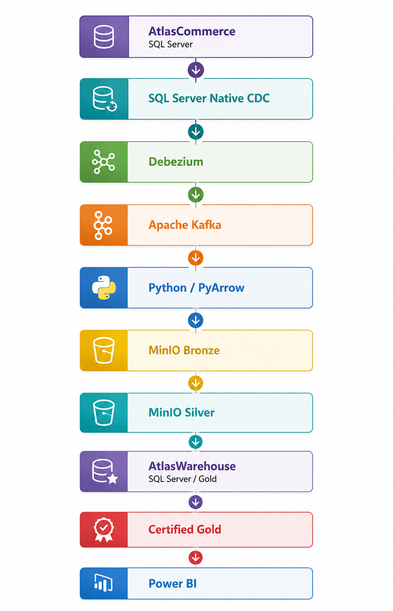

# Atlas Engineering — Plataforma de Dados Empresarial

## Visão Geral

Atlas Engineering é um projeto de plataforma de dados empresarial de ponta a ponta, projetado e desenvolvido desde o início como um portfólio técnico de engenharia.

A plataforma acompanha a evolução dos dados desde sua origem operacional, passando pela engenharia de dados, modelagem analítica e inteligência de negócios, com ênfase em arquitetura, qualidade de dados, reprodutibilidade, manutenibilidade e documentação técnica.

A primeira grande camada da plataforma é o **AtlasCommerce**, um sistema transacional SQL Server que representa a fonte de dados operacional de uma empresa de varejo de beleza.

O AtlasCommerce inclui um modelo de dados relacional completo, dados de exemplo determinísticos, scripts de implantação reexecutáveis, documentação de negócio e de banco de dados, regras de integridade entre domínios, validação temporal e certificação automatizada de dados.

A camada de banco de dados transacional está concluída e fornece a fonte operacional certificada para a implementação da arquitetura de Engenharia de Dados da Versão 1.

---

## Sumário

- [Arquitetura da Plataforma](#arquitetura-da-plataforma)
- [Status Atual do Projeto](#status-atual-do-projeto)
- [AtlasCommerce](#atlascommerce)
- [Destaques de Engenharia](#destaques-de-engenharia)
- [Estrutura do Repositório](#estrutura-do-repositório)
- [Documentação](#documentação)
- [Stack Tecnológico](#stack-tecnológico)
- [Roadmap](#roadmap)
- [Reprodutibilidade](#reprodutibilidade)
- [Propósito do Projeto](#propósito-do-projeto)

---

## Arquitetura da Plataforma

O Atlas Engineering foi projetado como uma plataforma de dados de ponta a ponta, na qual os dados operacionais são capturados, transportados, progressivamente transformados, validados, certificados e disponibilizados para consumo analítico.

A arquitetura de Engenharia de Dados da Versão 1 segue o fluxo abaixo:

<p align="center">
  
</p>

A arquitetura preserva limites explícitos entre dados operacionais, captura de alterações, transporte de eventos, persistência histórica, transformação, modelagem analítica, certificação e consumo.

Capacidades transversais dão suporte ao fluxo completo:

- **Apicurio Registry** fornece governança de *schemas* para contratos de eventos;

- **Apache Airflow** fornece orquestração dos fluxos de processamento;

- **Prometheus**, **Grafana** e *logs* estruturados fornecem a base inicial de observabilidade;

- requisitos de segurança, governança, confiabilidade, recuperação, testes e evidências se aplicam a toda a plataforma.

O AtlasCommerce permanece como o sistema operacional de registro. O processamento *downstream* é projetado para consumir alterações operacionais confirmadas sem transferir cargas de trabalho ou responsabilidades analíticas para a fonte transacional.

A arquitetura da Versão 1 está concluída e fornece a base técnica para a implementação do primeiro fluxo de Engenharia de Dados de ponta a ponta.

---

## Status Atual do Projeto

| Camada da Plataforma | Status | Descrição |
|---|---|---|
| Banco de Dados Operacional — AtlasCommerce | **Concluído** | Sistema transacional de origem em SQL Server, dados de exemplo determinísticos, validação, documentação e certificação |
| Engenharia de Dados — Arquitetura V1 | **Concluída** | Arquitetura de ponta a ponta abrangendo ingestão, processamento, qualidade, confiabilidade, recuperação, segurança, governança, testes, evidências e observabilidade |
| Engenharia de Dados — Implementação V1 | **Próxima Etapa** | Implementação e validação do primeiro fluxo de ponta a ponta utilizando o domínio Sales e o produto analítico Daily Sales |
| Data Warehouse — AtlasWarehouse | **Arquitetura Definida** | Camada de disponibilização analítica em SQL Server definida como a camada Gold da arquitetura de Engenharia de Dados V1 |
| Analytics — Power BI | **Arquitetura Definida** | Consumo analítico de dados certificados por meio da fronteira Certified Gold |

---

## AtlasCommerce

O **AtlasCommerce** é o banco de dados transacional operacional da plataforma Atlas Engineering.

Construído em SQL Server, ele modela as principais operações de uma empresa de varejo de beleza em oito domínios de negócio e de suporte:

| Domínio | Responsabilidade |
|---|---|
| `catalog` | marcas, categorias, produtos, variantes, atributos, imagens e preços |
| `customer` | clientes, documentos, contatos, endereços de e-mail e endereços de clientes |
| `inventory` | saldos de estoque, reservas, movimentações, motivos de movimentação e notas operacionais |
| `payment` | métodos de pagamento, ciclo de vida de pagamentos, reembolsos e motivos de reembolso |
| `sales` | transações, itens de transação, canais e ciclo de vida das transações |
| `shipping` | métodos de envio, ciclo de vida das remessas, endereços de entrega e rastreamento |
| `reference` | países, divisões administrativas, cidades, endereços e dados de referência compartilhados |
| `metadata` | metadados internos e governança de objetos do banco de dados |

### Engenharia de Banco de Dados

A camada de banco de dados do AtlasCommerce foi projetada com foco em implantação determinística e reproduzível, em vez de um processo de criação do banco de dados executado uma única vez.

Sua implementação inclui:

- implantação reexecutável do banco de dados, schemas, modelo de dados e dados de exemplo;

- criação controlada de objetos e validação estrutural;

- prefixos padronizados para tabelas e colunas;

- restrições de chave primária, chave estrangeira, unicidade, verificação e valor padrão;

- integridade referencial explícita e validação de dependências;

- projeto físico com suporte a particionamento;

- índices e posicionamento físico padronizados;

- regras de integridade temporal;

- validação de regras de negócio entre os domínios do banco de dados;

- geração determinística de dados de exemplo;

- reconciliação entre domínios financeiros, de estoque, vendas e remessas;

- certificação final automatizada dos dados.

### Conjunto de Dados de Exemplo

O conjunto de dados certificado atual contém atividade transacional de **1º de janeiro de 2025 a 24 de agosto de 2026**, dentro de um limite temporal fixo para os dados de exemplo, utilizado para implantação e validação determinísticas.

| Conjunto de Dados | Registros |
|---|---:|
| Transações | 6.306 |
| Itens de Transação | 13.769 |
| Reservas de Estoque | 4.116 |
| Movimentações de Estoque | 12.796 |
| Pagamentos | 6.959 |
| Reembolsos de Pagamentos | 272 |
| Remessas | 2.841 |

O conjunto de dados contém transações **STORE (LOJA)** e **ONLINE**, múltiplos estados de transações e pagamentos, reservas e movimentações de estoque, reembolsos, ciclos de vida de remessas, devoluções de clientes e outros cenários operacionais destinados a fornecer dados de origem significativos para as etapas posteriores de engenharia e análise.

### Certificação de Dados

O AtlasCommerce inclui um processo automatizado de certificação executado após a implantação dos dados de exemplo.

A certificação valida a integridade referencial, regras de negócio específicas dos domínios, consistência temporal e reconciliação em todo o modelo operacional.

```text
ATLASCOMMERCE DATA CERTIFICATION — PASS

Referential Integrity       : PASS
Sales Integrity             : PASS
Inventory Integrity         : PASS
Payment Integrity           : PASS
Shipping Integrity          : PASS
Temporal Integrity          : PASS
Cross-Domain Reconciliation : PASS
```

O conjunto de dados certificado do AtlasCommerce está, portanto, pronto para servir como fonte operacional para a camada de Engenharia de Dados.

---

## Destaques de Engenharia

O AtlasCommerce foi desenvolvido como um projeto de engenharia de banco de dados, e não apenas como uma fonte de registros de exemplo.

A implementação enfatiza implantação controlada, consistência estrutural, integridade de dados e reprodutibilidade durante todo o ciclo de vida do banco de dados.

### Implantação Reexecutável

Os scripts de implantação do banco de dados oferecem suporte tanto à instalação limpa quanto à reexecução segura, validando e preservando estruturas e dados existentes compatíveis, em vez de depender de recriação destrutiva.

### Padrões de Banco de Dados

O AtlasCommerce segue padrões documentados para:

- schemas, tabelas e colunas;

- prefixos de tabelas e colunas;

- chaves primárias e estrangeiras;

- restrições e índices;

- ordenação de objetos e dependências;

- posicionamento físico;

- documentação;

- implantação determinística de dados.

Essas convenções estão documentadas como parte do projeto e são aplicadas de forma consistente em toda a implementação do banco de dados.

### Integridade por Design

A integridade é validada em múltiplos níveis, em vez de depender exclusivamente de chaves estrangeiras.

O banco de dados valida:

- integridade referencial;

- regras de negócio;

- reconciliação monetária entre transações e itens de transação;

- reservas e saldos de estoque;

- saldos de movimentações de estoque;

- pagamentos e reembolsos;

- relacionamentos entre transações e remessas;

- consistência temporal entre eventos operacionais relacionados.

### Dados de Exemplo Determinísticos

O conjunto de dados de exemplo é gerado por meio de scripts controlados de implantação DML e utiliza um limite temporal fixo.

Isso torna o conjunto de dados reproduzível e permite que as mesmas validações de negócio, financeiras, de estoque, remessas e temporais sejam executadas de forma consistente entre as implantações.

### Certificação Antes do Consumo

A implantação dos dados de exemplo e a certificação são etapas separadas, e o conjunto de dados é liberado para processamento downstream somente após o estado resultante do banco de dados ser aprovado nas validações de integridade e reconciliação exigidas.

---

## Estrutura do Repositório

O repositório é organizado por responsabilidade da plataforma, separando os ativos dos sistemas de origem, estruturas de banco de dados, documentação de arquitetura e de negócio, scripts de implantação e recursos de validação.

```text
01-Enterprise-Data-Platform/
│
├── 01-Source/
│   └── Operational source-system assets
│
├── 02-Database/
│   └── Database-related structures and assets
│
├── 03-Documentation/
│   └── Technical, architectural, and business documentation
│
├── 04-Scripts/
│   └── Database, data deployment, and certification scripts
│
├── 05-Tests/
│   └── Validation and testing resources
│
├── .gitignore
│
└── README.md
```

### Áreas Principais

**`01-Source`**  
Contém ativos relacionados aos sistemas operacionais de origem que fornecem dados para a plataforma.

**`02-Database`**  
Contém estruturas e ativos relacionados aos bancos de dados utilizados pela plataforma. Os arquivos locais de dados e log do SQL Server são excluídos do controle de versão.

**`03-Documentation`**  
Contém a documentação técnica, arquitetural e de negócio da plataforma, incluindo a documentação do AtlasCommerce e a arquitetura de Engenharia de Dados da Versão 1.

**`04-Scripts`**  
Contém a estrutura executável de implantação da plataforma, incluindo criação do banco de dados SQL Server, implantação de schemas, implantação do modelo de dados, implantação determinística dos dados de exemplo e certificação de dados.

**`05-Tests`**  
Contém recursos de validação e testes utilizados para verificar os componentes da plataforma e o comportamento dos dados.

A estrutura do repositório continuará evoluindo à medida que a arquitetura de Engenharia de Dados da Versão 1 avançar do projeto documentado para a implementação e validação.

---

## Documentação

A documentação é tratada como parte da entrega de engenharia, e não como um artefato separado ou opcional do projeto.

O AtlasCommerce mantém documentação técnica e de negócio em **inglês** e **português brasileiro (PT-BR)**, quando aplicável.

### Documentação do AtlasCommerce

A documentação atual abrange:

- **Arquitetura** — decisões arquiteturais, organização do banco de dados, limites dos domínios e princípios de design;

- **Documentação de Negócio** — conceitos operacionais, regras de negócio, ciclo de vida das transações, estoque, pagamentos e comportamento das remessas;

- **Padrões de Banco de Dados** — schemas, convenções de nomenclatura, prefixos, chaves, restrições, índices, posicionamento físico, comportamento de implantação e regras para dados determinísticos;

- **Modelo de Domínio** — representação das entidades operacionais e seus relacionamentos;

- **Dicionário de Dados** — objetos de banco de dados documentados, colunas, relacionamentos e definições técnicas;

- **Diagrama Entidade-Relacionamento (ERD)** — representação visual do modelo de dados relacional do AtlasCommerce.

A documentação é mantida junto à implementação para que as decisões arquiteturais, regras de negócio e o comportamento do banco de dados permaneçam rastreáveis até a solução implantada.

### Documentação da Arquitetura de Engenharia de Dados

A arquitetura de Engenharia de Dados da Versão 1 é documentada como um conjunto coordenado de documentos de arquitetura que abrange todo o caminho desde a captura de alterações operacionais até o consumo analítico certificado.

O conjunto de documentação inclui:

- **Visão Geral da Arquitetura** — arquitetura de ponta a ponta, limites tecnológicos, princípios arquiteturais, escopo inicial de implementação e responsabilidades de toda a plataforma;

- **Fluxo e Processamento de Dados** — ingestão, transporte de eventos, processamento Bronze e Silver, modelagem Gold, certificação e comportamento de publicação;

- **Observabilidade** — monitoramento, métricas, logs, alertas, estado dos pipelines, visibilidade da certificação e disponibilidade downstream;

- **Confiabilidade e Recuperação** — idempotência, replay, reinicialização, isolamento de falhas, checkpoints, reconciliação e comportamento de recuperação;

- **Segurança e Governança** — identidade, controle de acesso, segredos, limites de confiança, proteção de dados, governança de privacidade e responsabilidades auditáveis;

- **Estratégia de Testes e Evidências** — estratégia de validação, categorias de testes, testes de falha e recuperação, retenção de evidências e limites entre capacidades demonstradas e planejadas.

Em conjunto, esses documentos definem a base técnica para implementar e validar o fluxo de Engenharia de Dados da Versão 1.

### Princípios da Documentação

A documentação do Atlas Engineering segue os mesmos princípios de engenharia aplicados em toda a plataforma:

- precisão técnica;

- terminologia consistente;

- decisões arquiteturais e de negócio explícitas;

- separação entre conceitos de negócio e implementação física do banco de dados;

- documentação bilíngue quando apropriado;

- evolução controlada por versão juntamente com o projeto.

---

## Stack Tecnológico

O Atlas Engineering combina tecnologias de banco de dados, engenharia de dados, análise, desenvolvimento e infraestrutura de acordo com as responsabilidades de cada camada da plataforma.

### Stack Implementado Atualmente

As tecnologias atualmente utilizadas pelos componentes implementados e validados da plataforma incluem:

| Tecnologia | Função |
|---|---|
| **SQL Server** | Banco de dados relacional operacional do AtlasCommerce |
| **T-SQL** | Implantação do banco de dados, validação, geração de dados de exemplo e certificação |
| **SQL Server Management Studio (SSMS)** | Desenvolvimento, administração, execução e validação do banco de dados |
| **Git** | Controle de versão e histórico do projeto |
| **GitHub** | Hospedagem do repositório e publicação do projeto |
| **Visual Studio Code** | Edição do repositório, documentação e arquivos-fonte |
| **Markdown** | Documentação técnica e de negócio controlada por versão |
| **Schemity Lite** | Design e visualização do diagrama entidade-relacionamento |

### Stack Arquitetural de Engenharia de Dados V1

A arquitetura de Engenharia de Dados da Versão 1 define as seguintes tecnologias para a próxima etapa de implementação:

| Tecnologia | Função Arquitetural |
|---|---|
| **SQL Server Native CDC** | Captura de alterações operacionais confirmadas do AtlasCommerce |
| **Debezium** | Conversão das alterações capturadas do banco de dados em fluxos de eventos |
| **Apache Kafka** | Transporte durável de eventos, buffering e processamento ordenado |
| **Apicurio Registry** | Governança de contratos e evolução de schemas |
| **Python / PyArrow** | Processamento e transformação de dados |
| **MinIO** | Camadas de armazenamento de objetos Bronze e Silver |
| **SQL Server** | Camada analítica Gold do AtlasWarehouse |
| **Apache Airflow** | Orquestração de workflows |
| **Prometheus** | Coleta de métricas e monitoramento |
| **Grafana** | Visualização operacional e observabilidade |
| **Power BI** | Consumo de dados analíticos certificados |

Essas tecnologias representam a **arquitetura definida para a Versão 1**, e não uma implementação concluída. O status de implementação será atualizado somente à medida que os componentes forem construídos, integrados, testados e sustentados por evidências.

### Expansão Tecnológica Futura

Tecnologias adicionais e novos cenários de plataforma poderão ser avaliados à medida que o Atlas Engineering se expandir além do escopo inicial da Versão 1, incluindo plataformas adicionais de banco de dados, fontes externas de dados, infraestrutura em nuvem e serviços gerenciados de dados.

A adoção de tecnologias permanece orientada por requisitos arquiteturais, em vez da adição de ferramentas independentemente de uma responsabilidade de engenharia definida.

---

## Roadmap

O Atlas Engineering é desenvolvido de forma incremental, com cada etapa avaliada em relação às entregas, critérios de validação e evidências apropriados ao seu escopo antes de ser representada como concluída.

| Etapa | Status | Escopo |
|---|---|---|
| **1. Banco de Dados Operacional — AtlasCommerce** | **Concluído** | Arquitetura transacional, modelo de dados, implantação, dados de exemplo determinísticos, validação, documentação e certificação |
| **2. Arquitetura de Engenharia de Dados V1** | **Concluída** | Arquitetura de ponta a ponta, desde a captura de alterações operacionais até o consumo analítico certificado, incluindo processamento, orquestração, observabilidade, confiabilidade, recuperação, segurança, governança, testes e evidências |
| **3. Implementação de Engenharia de Dados V1** | **Próxima Etapa** | Implementar e validar o primeiro fluxo de ponta a ponta utilizando o domínio Sales e o produto analítico Daily Sales |
| **4. Expansão da Plataforma** | **Planejada** | Estender os padrões validados de Engenharia de Dados para domínios de negócio, produtos analíticos e capacidades adicionais da plataforma |

A próxima etapa imediata é a implementação da arquitetura de Engenharia de Dados da Versão 1.

Sales fornece o primeiro recorte de negócio de ponta a ponta, com Daily Sales como o primeiro produto analítico certificado. O objetivo é validar o padrão arquitetural completo antes de expandi-lo para domínios e casos de uso analíticos adicionais.

As etapas futuras serão definidas a partir das capacidades demonstradas da plataforma e dos requisitos arquiteturais, em vez de uma sequência fixa orientada por tecnologias.

---

## Reprodutibilidade

A reprodutibilidade é um princípio fundamental de engenharia do AtlasCommerce.

O banco de dados é implantado por meio de um conjunto ordenado de scripts SQL Server que separa a criação da infraestrutura, a estrutura lógica, a implantação do modelo de dados, a implantação dos dados de exemplo e a certificação final dos dados.

### Fluxo de Implantação

```text
01 — Banco de Dados
     │
     ▼
02 — Schemas
     │
     ▼
03 — Modelo de Dados
     │
     ▼
04 — Dados de Exemplo
     │
     ▼
05 — Certificação de Dados
     │
     ▼
Fonte Operacional Certificada
```

A sequência principal de implantação é:

| Etapa | Script | Responsabilidade |
|---|---|---|
| **1** | `01-Create-AtlasCommerce-Database.sql` | Cria e valida o banco de dados AtlasCommerce e sua configuração física no nível do banco de dados |
| **2** | `02-Create-AtlasCommerce-Schema.sql` | Cria e valida os schemas necessários do banco de dados |
| **3** | `03-Deploy-AtlasCommerce-Data-Model.sql` | Implanta e valida o modelo de dados relacional e os objetos de banco de dados de suporte |
| **4** | `04-Deploy-AtlasCommerce-Data.sql` | Implanta o conjunto de dados de exemplo determinístico do AtlasCommerce |
| **5** | `05-Certify-AtlasCommerce-Data.sql` | Valida de forma independente o conjunto de dados resultante e o certifica para uso downstream |

### Comportamento Seguro para Reexecução

O processo de implantação foi projetado para ser reexecutado com segurança.

Os scripts inspecionam o estado existente do banco de dados antes de criar ou inserir as estruturas e os dados esperados. Objetos e registros existentes compatíveis são preservados, enquanto inconsistências estruturais ou de dados são apresentadas por meio de validação explícita, em vez de serem sobrescritas silenciosamente.

Esse comportamento permite que a mesma estrutura de implantação seja utilizada tanto para uma instalação limpa do banco de dados quanto para execuções posteriores de validação.

### Certificação Final

O ciclo de vida da implantação dos dados de exemplo é considerado concluído somente após a etapa de certificação retornar:

```text
ATLASCOMMERCE DATA CERTIFICATION — PASS
```

Uma certificação bem-sucedida confirma que o conjunto de dados de exemplo implantado atende às regras esperadas de integridade referencial, de negócio, financeira, de estoque, de remessas e temporal exigidas antes do consumo downstream.

Isso cria uma fronteira reproduzível e certificada entre o AtlasCommerce e o fluxo downstream de Engenharia de Dados.

---

## Propósito do Projeto

O Atlas Engineering é um portfólio técnico de longo prazo focado no projeto e na implementação de uma plataforma de dados empresarial, desde sua fonte operacional até sua camada de consumo analítico.

O projeto tem como objetivo demonstrar decisões de engenharia por meio de implementações funcionais, em vez de exemplos isolados ou exercícios desconectados de tecnologia.

Seu desenvolvimento enfatiza:

- arquitetura de banco de dados e de dados;

- implantação confiável e reproduzível;

- integridade e qualidade de dados;

- documentação técnica e de negócio;

- rastreabilidade das decisões arquiteturais;

- controle de versão e práticas de engenharia de software;

- engenharia de dados e modelagem analítica;

- integração progressiva de tecnologias de acordo com os requisitos arquiteturais.

Cada capacidade da plataforma evolui a partir de decisões arquiteturais explícitas, passando por implementação, validação e retenção de evidências antes de ser representada como concluída.

À medida que a plataforma evolui, este repositório preservará tanto a solução implementada quanto as decisões de engenharia e as evidências que a moldaram.